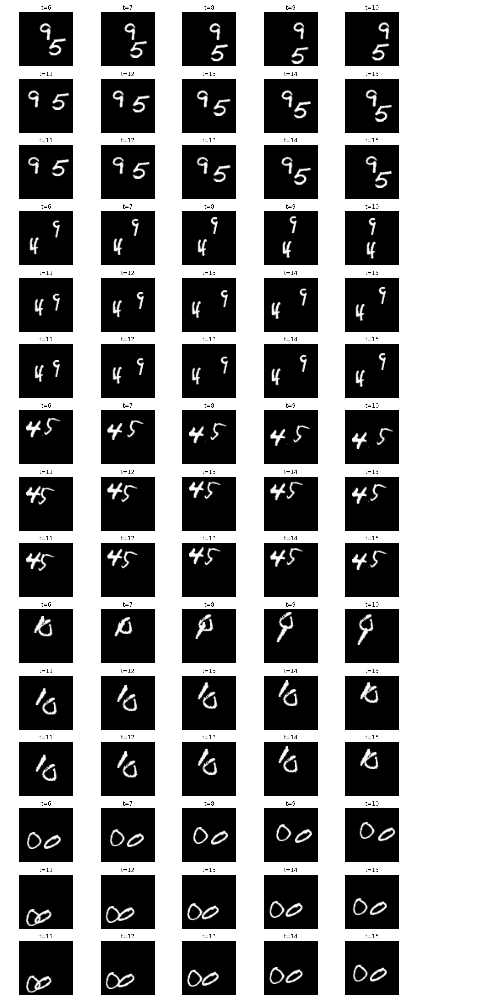

# ConvLSTM Video Prediction (Next-Frame Prediction)

Bu proje, ardışık video karelerini (Moving MNIST veri seti) kullanarak bir sonraki kareyi tahmin eden (**Next-Frame Prediction**) bir **ConvLSTM (Convolutional LSTM)** modelini uygular. Hem uzaysal (CNN) hem de zamansal (LSTM) özellikleri öğrenerek gelecekteki hareketleri ve şekilleri öngörür.

## 📂 Proje Yapısı

*   **Model:** 3 adet `ConvLSTM2D` katmanı ve 1 adet `Conv3D` çıktı katmanı.
*   **Veri Seti:** Moving MNIST (TensorFlow Datasets üzerinden otomatik indirilir).
*   **Girdi/Çıktı:** 19 karelik geçmiş verisinden 20. kareyi (veya bir sonraki 19 karelik diziyi) tahmin eder.
*   **Kayıp Fonksiyonları:** 
    *   Binary Cross Entropy (BCE)
    *   Perceptual Loss (VGG16 tabanlı algısal kayıp)
    *   Gradient Difference Loss (GDL - Keskinlik koruma)

## 🚀 Kurulum

1.  Repoyu klonlayın:
    ```bash
    git clone https://github.com/samettkartal/ConvLSTM-Video-Prediction.git
    cd ConvLSTM-Video-Prediction
    ```

2.  Gerekli kütüphaneleri yükleyin:
    ```bash
    pip install -r requirements.txt
    ```

## 💻 Kullanım

### Eğitimi Başlatma
Eğitimi başlatmak için `train.py` dosyasını çalıştırın:
```bash
python train.py
```
Model, eğitim sırasında `checkpoints/` klasörüne ağırlıkları kaydedecek ve `logs/` klasöründe log tutacaktır.

### Test ve Değerlendirme
Eğitilmiş modeli test etmek ve sonuçları görmek için:
```bash
python evaluate.py
```
Bu işlem sonucunda PSNR, SSIM ve MSE gibi metrikler hesaplanır ve `results/` klasörüne örnek tahmin görselleri kaydedilir.

## 📊 Sonuçlar

Modelin tahmin başarısı:

| Metrik | Değer |
|--------|-------|
| PSNR   | ~25.0dB |
| SSIM   | ~0.85 |
| MSE    | Düşük |

### Görsel Sonuçlar

Aşağıdaki görselde; üst satır gerçek (ground truth) görüntüleri, alt satır ise modelin tahmin ettiği (prediction) görüntüleri göstermektedir.



### Eğitim Kayıp Grafiği


## 🛠 Model Mimarisi

```mermaid
graph TD
    Input[Girdi: (None, 19, 64, 64, 1)] --> L1[ConvLSTM2D: 64 Filters, 5x5]
    L1 --> BN1[Batch Normalization]
    BN1 --> L2[ConvLSTM2D: 64 Filters, 3x3]
    L2 --> BN2[Batch Normalization]
    BN2 --> L3[ConvLSTM2D: 64 Filters, 1x1]
    L3 --> BN3[Batch Normalization]
    BN3 --> Out[Conv3D: 1 Filter, 3x3x3, Sigmoid]
    Out --> Prediction[Tahmin: (None, 19, 64, 64, 1)]
```

## 📧 İletişim

Geliştirici: Samet Kartal
E-posta: 220212006@ostimteknik.edu.tr
