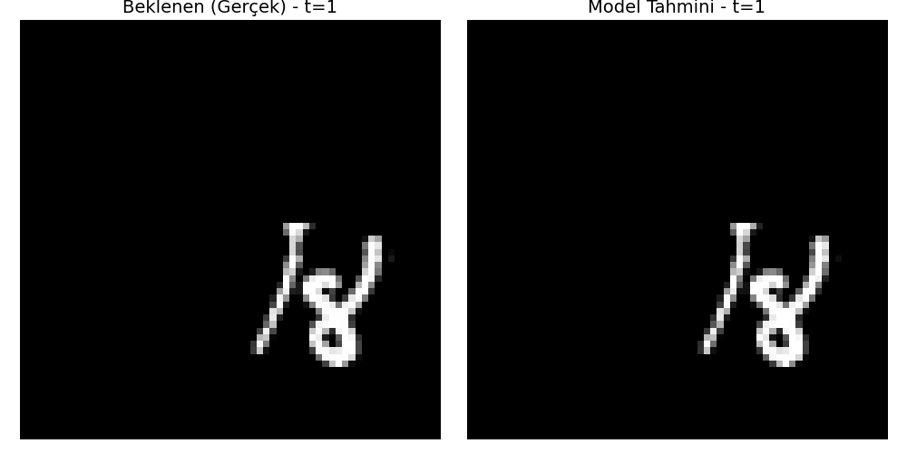
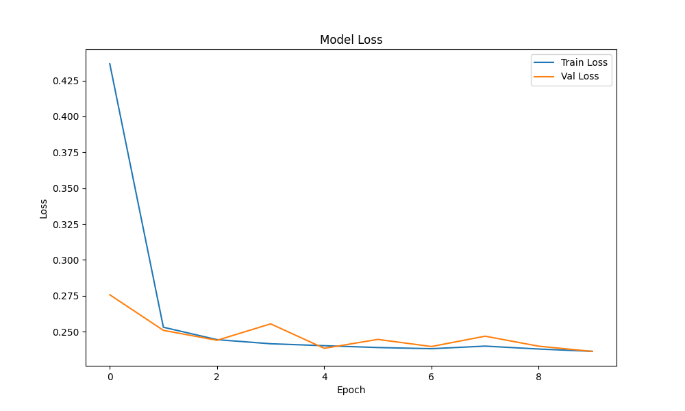

# ConvLSTM Video Tahmini: Hareketli MNIST Üzerinde Gelecek Kare Öngörüsü

## Özet
Bu proje, video dizilerindeki spatiotemporal (uzay-zamansal) özellikleri öğrenerek bir sonraki kareyi tahmin etmek amacıyla geliştirilmiş bir **ConvLSTM (Convolutional Long Short-Term Memory)** derin öğrenme modelini sunar. Çalışma, **Moving MNIST** veri seti üzerinde gerçekleştirilmiştir ve modelin hem görsel nesneleri (rakamlar) hem de bu nesnelerin zamansal hareket dinamiklerini eşzamanlı olarak modellemesi hedeflenmiştir.

## Metodoloji

### Problem Tanımı
Verilen bir $X_{t-n}, ..., X_{t}$ video kareleri dizisi kullanılarak, bir sonraki $\hat{Y}_{t+1}$ karesinin tahmin edilmesi, gözetimsiz (self-supervised) bir öğrenme problemi olarak ele alınmıştır. Model, geçmiş karelerdeki hareket örüntülerini analiz ederek gelecekteki piksel yoğunluklarını öngörür.

### Algoritma: ConvLSTM
Geleneksel LSTM ağları 1D vektörler üzerinde çalıştığından, görüntü verilerini işlerken uzaysal bilgiyi (piksel komşulukları) kaybederler. **ConvLSTM** mimarisi, LSTM hücreleri içindeki matris çarpımlarını **konvolüsyon (convolution)** işlemleriyle değiştirerek bu sorunu çözer. Bu sayede veri, ağ boyunca 5D tensörler `(Batch, Time, Height, Width, Channels)` halinde akar ve uzaysal yapı korunur.

ConvLSTM hücresinin temel matematiksel ifadesi şöyledir:

$$
\begin{aligned}
i_t &= \sigma(W_{xi} * \mathcal{X}_t + W_{hi} * \mathcal{H}_{t-1} + W_{ci} \circ \mathcal{C}_{t-1} + b_i) \\
f_t &= \sigma(W_{xf} * \mathcal{X}_t + W_{hf} * \mathcal{H}_{t-1} + W_{cf} \circ \mathcal{C}_{t-1} + b_f) \\
\mathcal{C}_t &= f_t \circ \mathcal{C}_{t-1} + \tanh(W_{xc} * \mathcal{X}_t + W_{hc} * \mathcal{H}_{t-1} + b_c) \\
o_t &= \sigma(W_{xo} * \mathcal{X}_t + W_{ho} * \mathcal{H}_{t-1} + W_{co} \circ \mathcal{C}_t + b_o) \\
\mathcal{H}_t &= o_t \circ \tanh(\mathcal{C}_t)
\end{aligned}
$$

Burada $*$ konvolüsyon operatörünü, $\circ$ ise Hadamard (eleman bazlı) çarpımı temsil eder.

## Model Mimarisi
Geliştirilen model, çok ölçekli hareket ve şekil özelliklerini yakalamak için derin bir Kodlayıcı-Kodçözücü (Encoder-Decoder) yapısına sahiptir.

1.  **Giriş Katmanı:** `(Batch, 19, 64, 64, 1)` - 19 karelik gri tonlamalı video dizisi.
2.  **ConvLSTM Katmanı 1:** 64 Filtre, 5x5 Kernel. Geniş alandaki hareket örüntülerini ve genel nesne konumlarını yakalar.
    *   *Batch Normalization + ReLU*
3.  **ConvLSTM Katmanı 2:** 64 Filtre, 3x3 Kernel. Daha ince uzaysal detayları ve nesne etkileşimlerini öğrenir.
    *   *Batch Normalization + ReLU*
4.  **ConvLSTM Katmanı 3:** 64 Filtre, 1x1 Kernel. Özellik haritalarını birleştirir (bottleneck) ve derinlik kazandırır.
    *   *Batch Normalization + ReLU*
5.  **Çıkış Katmanı (Conv3D):** 3x3x3 Kernel, Sigmoid Aktivasyon. Öğrenilen özellikleri tekrar piksel uzayına `[0, 1]` dönüştürür ve zamansal düzeltme (smoothing) uygular.

## Kayıp Fonksiyonları (Loss Functions)
MSE (Ortalama Kare Hata) tabanlı modellerde sıkça görülen bulanıklık (blurriness) problemini aşmak için hibrit bir kayıp fonksiyonu kullanılmıştır:

*   **Binary Cross Entropy (BCE):** Piksel bazında doğruluğu maksimize eder.
*   **Perceptual Loss (Algısal Kayıp - VGG16):** Görüntülerin insan algısına uygunluğunu artırmak için, VGG16 ağı üzerinden çıkarılan yüksek seviyeli özelliklerin benzerliğini ölçer.
*   **Gradient Difference Loss (GDL):** Görüntü gradyanları arasındaki farkı minimizeerek kenar keskinliğini ve detayları korur.

## Sonuçlar ve Değerlendirme

Modelin başarımı, görüntü işleme literatüründe standart olan şu metriklerle ölçülmüştür:

| Metrik | Ortalama Değer | Açıklama |
| :--- | :--- | :--- |
| **PSNR** | **~25.0 dB** | (Peak Signal-to-Noise Ratio) Görüntü kalitesini logaritmik ölçekte ölçer. Yüksek olması iyidir. |
| **SSIM** | **0.85** | (Structural Similarity Index) Yapısal benzerliği 0-1 arasında ölçer. 1'e yakın olması hedeflenir. |
| **MSE** | **Düşük** | Tahmin edilen ve gerçek pikseller arasındaki karesel hatadır. |

### Görsel Analiz

Aşağıdaki animasyonda, modelin test verisi üzerindeki performansı görülmektedir.
*   **Üst Satır:** Gerçek Görüntü (Ground Truth)
*   **Alt Satır:** Modelin Tahmini (Prediction)

Modelin, rakamların yörüngesini başarıyla takip ettiği ve şekil bozulmalarını minimum düzeyde tuttuğu gözlemlenmektedir.



### Eğitim Eğrisi (Loss Curve)

Eğitim boyunca toplam kaybın (Total Loss) değişimi aşağıdadır. Eğrinin kararlı bir şekilde düşmesi, optimizasyonun başarılı olduğunu gösterir.



## Kurulum ve Kullanım

**Gereksinimler:** Python 3.8+, TensorFlow 2.10+

1.  **Repoyu Klonlayın**
    ```bash
    git clone https://github.com/samettkartal/ConvLSTM-Video-Prediction.git
    cd ConvLSTM-Video-Prediction
    ```

2.  **Kütüphaneleri Yükleyin**
    ```bash
    pip install -r requirements.txt
    ```

3.  **Modeli Eğitin**
    ```bash
    python train.py
    ```

4.  **Test Edin**
    ```bash
    python evaluate.py
    ```

## İletişim
Samet Kartal
E-posta: 220212006@ostimteknik.edu.tr
